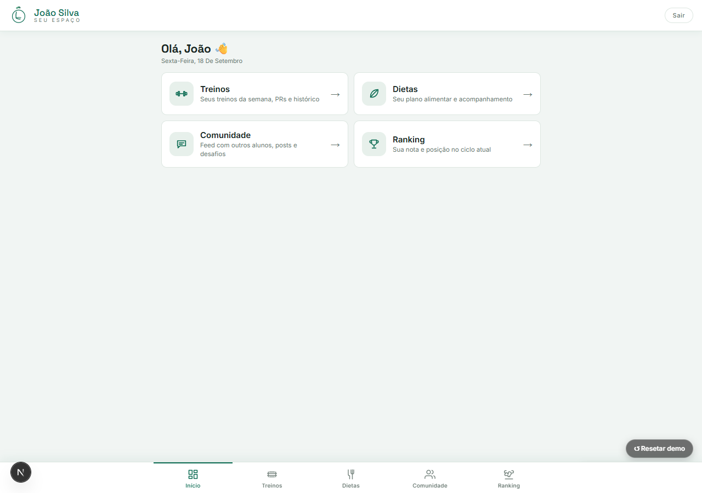
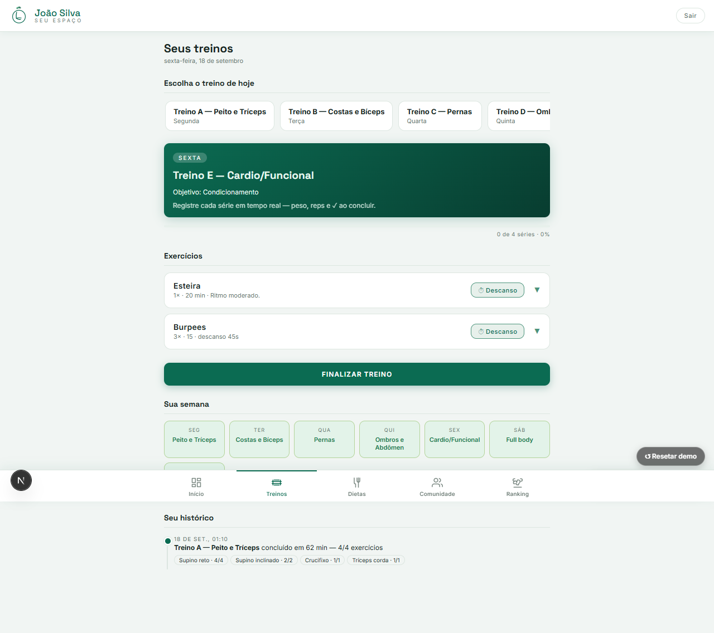
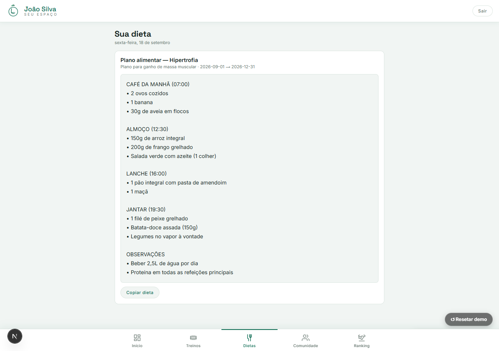
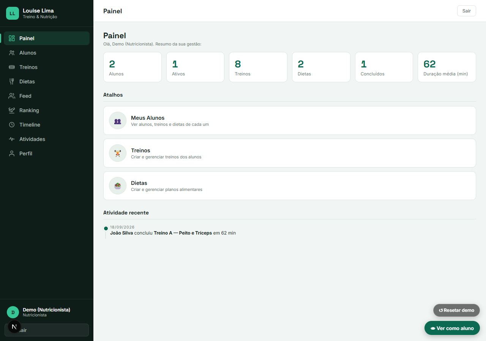

# Treino Louise — App profissional (Go + Next.js + Firestore)

Migração do app de treino da **Louise Lima** para uma arquitetura profissional
com login e dados na nuvem — tudo dentro da **camada gratuita** do Google Cloud.

## 📸 Screenshots

Capturas reais da aplicação (modo demo, dados de exemplo):

- **Dashboard do aluno** — visão geral da rotina e funcionalidades disponíveis.
- **Treinos** — gerenciamento e visualização dos treinos.
- **Dietas** — acompanhamento do plano alimentar.
- **Área administrativa** — gerenciamento dos alunos e conteúdos.









## O que cada parte faz

```
┌─────────────────────┐      login e senha       ┌──────────────────────┐
│ Frontend (Next.js)  │ ───────────────────────► │ Firebase Authentication│
│ Cloud Run (grátis)  │                          └──────────────────────┘
└─────────┬───────────┘
          │ chama a API com "Authorization: Bearer <token>"
          ▼
┌─────────────────────┐        salva e lê         ┌──────────────────────┐
│ Backend (Go)        │ ───────────────────────► │ Firestore (NoSQL)    │
│ Cloud Run (grátis)  │                          │ (grátis)             │
└─────────────────────┘                          └──────────────────────┘
```

- **Frontend**: Next.js (React) com `output: "standalone"` — um **servidor Node**
  autocontido no **Cloud Run**. O modo servidor permite **rotas dinâmicas**
  (ex. `/nutritionist/students/[studentId]`), que não existem em exportação
  estática.
- **Backend**: API em **Go** no **Cloud Run** — verifica o token do Firebase e
  acessa o Firestore (o usuário nunca fala direto com o banco).
- **Banco**: **Firestore** (NoSQL) — dados por usuário em `users/{uid}/...`.
- **Login**: **Firebase Authentication** (e-mail/senha ou **Google**).
- **Cadastro**: usuário novo precisa da **aprovação do admin** antes de usar o
  app (papel e plano de acesso definidos pelo admin).

## Estrutura do projeto

```
├── backend/          # API Go (Cloud Run)
│   ├── main.go       # bootstrap, injeção de dependências e rotas
│   ├── models/       # structs (Session, PR, AppState, UserProfile, Workout, Diet…)
│   ├── repository/   # acesso ao Firestore (CRUD de tudo)
│   ├── service/      # regras de negócio (ciclos, dietas, ranking, pontuação, social)
│   ├── middleware/   # auth (Firebase), CORS, security headers, rate limit
│   ├── handlers/     # endpoints HTTP (testes em */*_test.go)
│   ├── Dockerfile    # imagem para o Cloud Run
│   └── go.mod
├── frontend/         # app Next.js (Cloud Run — modo servidor/standalone)
│   ├── app/          # páginas (login, home, aluno, painel do nutricionista, admin)
│   │   ├── (aluno)/  # área do aluno: treinos, dietas e comunidade
│   │   ├── base.css  # design system global (dashboard.css/student.css por área)
│   │   └── ...       # nutritionist/, admin/, profile/[id]/
│   ├── components/   # UI (layout, cards, timer, modais, formulários, student/)
│   ├── lib/          # firebase, api, auth (roles), tipos, dias da semana
│   ├── public/       # ícones, manifest, service worker
│   ├── Dockerfile    # imagem do frontend para o Cloud Run
│   └── .env.example  # modelo das variáveis
├── .opencode/skills/ # skills de governança (boas práticas, segurança, UX, planos)
├── firebase.json     # configuração do Firebase Hosting + Firestore
├── firestore.rules   # regras de segurança do banco
└── .firebaserc       # projeto Firebase padrão
```

> A pasta `treino-louise-main/` (versão antiga, arquivo único) continua existindo
> como referência até a migração terminar.

## Pré-requisitos

- **Node.js 20+** e npm ✅ (já instalado na máquina)
- **Go 1.23+** ❌ (instalar agora: https://go.dev/dl)
- **Firebase CLI**: `npm install -g firebase-tools`
- **Google Cloud CLI (gcloud)**: https://cloud.google.com/sdk/docs/install
- **Docker** (para build local do backend, opcional — dá pra usar `gcloud builds submit` sem Docker local)

---

## Modo demo (ver o app funcionando hoje, sem Firebase)

Só precisa do Node. Sem configurar nada no Google:

```bash
cd frontend
copy .env.example .env.local   # no Linux: cp .env.example .env.local
npm install                    # já feito se você seguiu a migração
```

No arquivo `frontend/.env.local`, coloque:

```
NEXT_PUBLIC_DEMO=1
```

Rode `npm run dev` e abra **http://localhost:3000** — o app entra direto numa
conta demo **do nutricionista**, com alunos, treinos e dietas de exemplo
(alunos, CRUD, duplicação, timeline e finalização de treino funcionam; tudo
fica salvo no navegador). Troque para `NEXT_PUBLIC_DEMO=0` quando for conectar
o Firebase de verdade.

> O modo demo simula o backend Go inteiro em memória/localStorage — útil
> também pra entender o fluxo antes de subir o Cloud Run.

> ⚠️ **Windows Defender**: o `go build` local às vezes é bloqueado com
> "contém um vírus ou software potencialmente indesejado" — é falso positivo
> em binários Go. Não afeta o deploy (o `gcloud builds submit` compila na
> nuvem do Google). Se quiser compilar local, adicione exceção no Windows
> Security para a pasta do projeto e para `%TEMP%`. O `go vet` não é bloqueado
> (valida o código sem gerar executável).

---

## Guia de configuração (tudo de graça)

### Passo 1 — Criar o projeto no Firebase

1. Acesse https://console.firebase.google.com e clique em **Adicionar projeto**.
2. Nome do projeto: ex. `treino-louise` (ou o que quiser).
3. **Desative o Google Analytics** (a menos que queira).
4. O plano gratuito (**Spark**) é o padrão — perfeito.

### Passo 2 — Ativar Authentication (login)

1. No console, menu **Build → Authentication → Get started**.
2. Na aba **Sign-in method**, habilite **E-mail/Senha** e **Google** e salve.
3. (Opcional) Crie um usuário de teste em **Users → Add user**.

### Passo 3 — Criar o Firestore (banco NoSQL)

1. Menu **Build → Firestore Database → Create database**.
2. Modo de produção.
3. Região: escolha a mais próxima (o app dá deploy no Cloud Run na mesma região).
4. Depois publique as regras: rode `firebase deploy --only firestore` na raiz deste projeto.

### Passo 4 — Pegar as chaves do frontend

1. Console → ⚙️ **Configurações do projeto → Seus apps**.
2. Se não existir app web: clique no ícone **</> (Web)** e registre (ex. nome "treino-web").
3. Copie o objeto `firebaseConfig` (apiKey, authDomain, projectId, …) para o
   arquivo `frontend/.env.local`:

```bash
cd frontend
cp .env.example .env.local   # no Windows: copy .env.example .env.local
```

Preencha todas as `NEXT_PUBLIC_FIREBASE_*` com os valores do console.

### Passo 5 — Subir o backend Go no Cloud Run

Precisa do **gcloud** instalado e logado:

```bash
gcloud auth login
gcloud config set project SEU_PROJECT_ID
```

Troque `SEU_PROJECT_ID` pelo id do projeto (o mesmo do Firebase). Depois:

```bash
cd backend

# Via gcloud build (não precisa de Docker local):
gcloud builds submit --tag southamerica-east1-docker.pkg.dev/SEU_PROJECT_ID/treino-api/treino-api

# Publica no Cloud Run (cota gratuita):
# ⚠️ PRODUÇÃO DEVE definir ALLOWED_ORIGIN com a origem EXATA do frontend
#    (ex.: https://treino-web-XXXXX-southamerica-east1.a.run.app, ou o domínio próprio).
#    Sem essa variável o backend responde com CORS "*" (permissivo) —
#    aceitável em dev, não recomendado em produção. NUNCA use "*".
gcloud run deploy treino-api \
  --image southamerica-east1-docker.pkg.dev/SEU_PROJECT_ID/treino-api/treino-api \
  --region southamerica-east1 \
  --platform managed \
  --allow-unauthenticated \
  --max-instances 1 \
  --memory 128Mi \
  --set-env-vars "ALLOWED_ORIGIN=https://treino-web-XXXXX-southamerica-east1.a.run.app" \
  --update-env-vars "RATE_LIMIT=120"
```

> **Índice do Firestore para diet-logs (obrigatório):** `GET /api/diet-logs`
> (calendário/adesão à dieta) consulta a coleção `dietLogs` com
> `studentId == X ORDER BY date DESC`, o que exige um **índice composto**.
> Sem ele a query falha com `FAILED_PRECONDITION: the query requires an index`
> e o endpoint responde `500`:
>
> ```bash
> gcloud firestore indexes composite create \
>   --project SEU_PROJECT_ID \
>   --collection-group=dietLogs \
>   --field-config=field-path=studentId,order=ASCENDING \
>   --field-config=field-path=date,order=DESCENDING
> ```
>
> Aguarde o estado do índice ficar `READY` antes de usar a página de detalhes
> do aluno (o calendário chama esse endpoint ao carregar).

O comando no final mostra a **URL da sua API**. Copie para o `.env.local`:

```bash
NEXT_PUBLIC_API_URL=https://treino-api-XXXXX-southamerica-east1.a.run.app
```

> Como o backend roda com a identidade do Cloud Run (Service Account padrão),
> ele já tem acesso ao Firestore do mesmo projeto — sem chaves na mão. 🎉

**Alternativa local (para desenvolver):**

1. Console Firebase → ⚙️ → **Contas de serviço** → **Gerar nova chave privada**
   (baixa um `serviceAccountKey.json`).
2. Rode:
   ```bash
   cd backend
   $env:GOOGLE_APPLICATION_CREDENTIALS="C:\caminho\serviceAccountKey.json"
   go mod tidy
   go run .
   ```
   A API sobe em `http://localhost:8080`. Ajuste `NEXT_PUBLIC_API_URL=http://localhost:8080`.
3. **Nunca** suba esse JSON para o git (o `.gitignore` já bloqueia).

### Passo 6 — Rodar o frontend local

```bash
cd frontend
npm install
npm run dev
```

Abra http://localhost:3000, crie uma conta e comece a usar.

### Passo 7 — Publicar o frontend (Cloud Run)

O frontend agora roda como **servidor Node standalone** (rotas dinâmicas e
SSR). A imagem do Docker está em `frontend/Dockerfile`:

```bash
cd frontend
# Teste local (opcional): gera .next com as variáveis do .env.local.
npm run build

# (opcional) testar o servidor de produção localmente:
#   Copy-Item -Recurse .next\static .next\standalone\.next\static
#   Copy-Item -Recurse public\* .next\standalone\
#   node .next/standalone/server.js   → http://localhost:3000

cd ..
```

**IMPORTANTE — variáveis no build do container:** o `.env.local` **não** vai
para o contexto docker (está no `.dockerignore`). O `frontend/Dockerfile`
recebe os valores públicos como **build args** (`NEXT_PUBLIC_*`), e quem os
repassa é o arquivo versionado [`frontend/cloudbuild.yaml`](frontend/cloudbuild.yaml)
via `--substitutions` (são dados públicos do cliente — **nunca** passe chaves de
serviço/private keys aqui). O guia completo e validado está na seção
[Deploy do Frontend](#deploy-do-frontend).

```bash
# 1) Build da imagem no Cloud Build (valores públicos via placeholders)
#    Use SEMPRE o cloudbuild.yaml versionado: ele passa os --build-arg corretos.
gcloud builds submit frontend \
  --config frontend/cloudbuild.yaml \
  --project treino-louise \
  --substitutions "_API_URL=REPLACE_ME_API_URL,_API_KEY=REPLACE_ME_FIREBASE_API_KEY,_AUTH_DOMAIN=REPLACE_ME_AUTH_DOMAIN,_FIREBASE_PROJECT_ID=REPLACE_ME_PROJECT_ID,_STORAGE_BUCKET=REPLACE_ME_STORAGE_BUCKET,_SENDER_ID=REPLACE_ME_SENDER_ID,_APP_ID=REPLACE_ME_APP_ID"

# 2) Publica a imagem no Cloud Run (nova revisão)
gcloud run deploy treino-web \
  --image southamerica-east1-docker.pkg.dev/treino-louise/treino-web/treino-web:latest \
  --region southamerica-east1 \
  --project treino-louise \
  --platform managed \
  --allow-unauthenticated \
  --max-instances 1 \
  --memory 512Mi
```

> **NEXT_PUBLIC_DEMO** fica de fora de propósito: em produção o modo demo deve
> estar desligado, e o `.env.local` que o ativa não entra na imagem.

O link final fica em `https://treino-web-834622951375.southamerica-east1.run.app`
(ou no domínio próprio configurado).

> **Atualização do app:** repita os dois comandos acima — a tag `:latest` é
> sobrescrita e o Cloud Run cria uma nova revisão.

### Passo 8 — Propagar as regras do Firestore

```bash
firebase deploy --only firestore
```

---

## Deploy do Frontend

Referência do build/deploy do serviço `treino-web` (Cloud Run + Cloud Build).
Este é o fluxo **validado** com o Google Cloud SDK atual (linha 58x); siga-o
em vez de `gcloud run deploy --source`.

### 1. Pré-requisitos

- `gcloud` autenticado e projeto selecionado:
  ```bash
  gcloud auth login
  gcloud config set project treino-louise
  ```
- Permissões de **Cloud Build**, **Artifact Registry** e **Cloud Run** no projeto.
- Docker **não** é necessário na máquina: o build roda no Cloud Build.

### 2. Projeto, região e serviço

| Item | Valor |
|------|-------|
| Projeto GCP | `treino-louise` |
| Região | `southamerica-east1` |
| Serviço Cloud Run | `treino-web` |
| Repositório de imagem | `southamerica-east1-docker.pkg.dev/treino-louise/treino-web/treino-web` |
| Arquivo de build | [`frontend/cloudbuild.yaml`](frontend/cloudbuild.yaml) |

### 3. Como os `NEXT_PUBLIC_*` entram no build

Fluxo real (o que produz a imagem):

```text
gcloud builds submit frontend --config frontend/cloudbuild.yaml --substitutions ...
        │  (valores PÚBLICOS: API URL + firebaseConfig do app Web)
        ▼
Cloud Build executa os steps do frontend/cloudbuild.yaml
        │  docker build --build-arg NEXT_PUBLIC_* ...
        ▼
frontend/Dockerfile  (ARG NEXT_PUBLIC_* → ENV NEXT_PUBLIC_*)
        │
        ▼
npm run build  ← Next.js embute as NEXT_PUBLIC_* no bundle do navegador
        │
        ▼
imagem publicada no Artifact Registry (tag :latest)
        │
        ▼
gcloud run deploy treino-web --image ...  → nova revisão, 100% do tráfego
```

O `.env.local` **não** entra no contexto docker (`.dockerignore`), por isso os
valores vão como `--build-arg` repassados pelo `cloudbuild.yaml`. São **dados
públicos do cliente** (ficam visíveis no bundle do navegador). Use sempre
placeholders no lugar de valores reais e nunca coloque secrets aqui.

### 4. Build (Cloud Build)

```bash
gcloud builds submit frontend \
  --config frontend/cloudbuild.yaml \
  --project treino-louise \
  --substitutions "_API_URL=REPLACE_ME_API_URL,_API_KEY=REPLACE_ME_FIREBASE_API_KEY,_AUTH_DOMAIN=REPLACE_ME_AUTH_DOMAIN,_FIREBASE_PROJECT_ID=REPLACE_ME_PROJECT_ID,_STORAGE_BUCKET=REPLACE_ME_STORAGE_BUCKET,_SENDER_ID=REPLACE_ME_SENDER_ID,_APP_ID=REPLACE_ME_APP_ID"
```

- Use o **separador padrão (vírgula)** entre as substituições. **Não** use
  separador customizado `^:^`: os valores contêm `:` (URL `https://…` e o
  `appId` `1:…:web:…`) e o parse quebra (`Bad syntax for dict arg`).
  Validado com `gcloud builds submit --substitutions` nesta versão do SDK.
- Os nomes das substituições (`_API_URL`, `_API_KEY`, …) são exatamente os que o
  `frontend/cloudbuild.yaml` espera.

### 5. Deploy (Cloud Run)

```bash
gcloud run deploy treino-web \
  --image southamerica-east1-docker.pkg.dev/treino-louise/treino-web/treino-web:latest \
  --region southamerica-east1 \
  --project treino-louise \
  --platform managed \
  --allow-unauthenticated \
  --max-instances 1 \
  --memory 512Mi
```

### 6. Validar a revisão e o tráfego (100%)

```bash
# Lista as revisões (mais recente no topo)
gcloud run revisions list --service treino-web \
  --region southamerica-east1 --project treino-louise

# Revisão ativa + URL do serviço
gcloud run services describe treino-web \
  --region southamerica-east1 --project treino-louise \
  --format="value(status.latestReadyRevisionName,status.url)"

# Páginas principais devem responder 200 (5xx = problema)
curl -s -o /dev/null -w "%{http_code}\n" https://treino-web-834622951375.southamerica-east1.run.app/
curl -s -o /dev/null -w "%{http_code}\n" https://treino-web-834622951375.southamerica-east1.run.app/login
```

> O serviço responde tanto pela URL nova
> (`https://treino-web-834622951375.southamerica-east1.run.app`) quanto pelo
> alias antigo (`https://treino-web-jn4epizxfq-rj.a.run.app`) — os dois apontam
> para a mesma revisão. O `status.url` do comando acima pode mostrar o alias
> antigo; use a URL do console/DNS que o app consome.

### 7. Validar o CSP (produção sem `unsafe-eval`)

```bash
# Linux/macOS
curl -sI https://treino-web-834622951375.southamerica-east1.run.app/ | grep -i content-security-policy
# Windows (PowerShell)
# (Invoke-WebRequest https://treino-web-834622951375.southamerica-east1.run.app/).Headers["Content-Security-Policy"]
```

Esperado: `script-src 'self' 'unsafe-inline'` — **sem** `'unsafe-eval'`
(em dev o `frontend/next.config.ts` libera `unsafe-eval` só para o HMR).

### 8. ⚠️ O que NÃO usar no SDK atual

- `gcloud run deploy --source ... --build-arg ...` → o `--build-arg` **não
  existe** nessa variante (foi removido nas versões recentes do SDK).
- `gcloud run deploy --source ... --set-build-env-vars ...` → **não** alimenta
  os `ARG` do `frontend/Dockerfile`; o build sai com as `NEXT_PUBLIC_*` vazias
  (foi exatamente o que gerou uma revisão com o Firebase client config vazio).
- Para builds que usam `ARG`, use **sempre** o fluxo
  `gcloud builds submit --config frontend/cloudbuild.yaml`.

> A tag `:latest` é sobrescrita a cada build. Para rollback, publique a imagem
> por digest (`--image <repo>@sha256:...`) de uma revisão anterior.

---

## Cotas gratuitas (Spark plan)

| Recurso                 | Cota grátis                          | Pra ver isso, use…           |
|-------------------------|--------------------------------------|------------------------------|
| Cloud Run (frontend)    | ~2 milhões de requests/mês + instância grátis | o app de treino inteiro      |
| Firestore               | 1 GiB, 50 mil leituras/dia, 20 mil gravações/dia | só dados de séries, sem foto |
| Cloud Run (API Go)      | ~2 milhões de requests/mês + instância grátis   | perfeito pra esse uso        |
| Authentication          | 50 mil usuários ativos/mês           | conta pessoal / alunos       |

> Dica do Cloud Run: com `--max-instances 1` e `--min-instances 0` a instância
> "dorme" quando ninguém usa (sem cobrança) e acorda na primeira chamada
> (os primeiros ~3s são um pouco mais lentos — normal).

## Aprendizado — o que cada peça te ensina

- **Firebase Auth**: autenticação, tokens JWT, sessão.
- **Firestore**: banco NoSQL, modelos de dados, regras de segurança.
- **Go + Cloud Run**: API REST, containerização (Dockerfile), deploy serverless.
- **Next.js**: React, componentes, SSR/SSG, variáveis de ambiente.
- **JWT no backend**: como um servidor confirma que uma requisição é de um usuário real.

## API (referência rápida)

Todas as rotas exigem `Authorization: Bearer <idToken>` (menos `/health`).

### Fluxo do aluno (original)

| Método | Rota                          | Descrição                                  |
|--------|-------------------------------|--------------------------------------------|
| GET    | `/health`                     | Health check                               |
| GET    | `/api/sessions/{week}/{day}`  | Lê o treino (ex. `/api/sessions/3/tb`)     |
| PUT    | `/api/sessions/{week}/{day}`  | Salva o treino                             |
| GET    | `/api/prs`                    | Lê os recordes pessoais                    |
| PUT    | `/api/prs`                    | Salva os recordes pessoais                 |
| GET    | `/api/state`                  | Lê a última posição (semana/dia)           |
| PUT    | `/api/state`                  | Salva a última posição                     |

### Gestão (nutricionista/admin/aluno) — nova área

| Método | Rota                          | Descrição                                  |
|--------|-------------------------------|--------------------------------------------|
| GET    | `/api/me`                     | Perfil do usuário + role                    |
| PUT    | `/api/me`                     | Cria/atualiza o perfil (setup inicial)      |
| GET/POST | `/api/users`                | Lista/cria usuários (admin)                 |
| GET/PUT/DELETE | `/api/users/{id}`    | Edita/exclui usuário (admin)                |
| GET    | `/api/users/pending`          | Usuários aguardando aprovação (admin)       |
| POST   | `/api/users/{id}/approve`     | Aprova cadastro (define papel, opcionalmente plano) |
| POST   | `/api/users/{id}/reject`      | Recusa cadastro (motivo; exclui a conta Firebase) |
| POST   | `/api/users/{id}/assign-plan` | Atribui plano (snapshot das features no perfil) |
| GET/POST | `/api/plans`               | Lista/cria planos (admin)                   |
| GET/PUT/DELETE | `/api/plans/{id}`    | Edita/exclui plano (admin; exclusão bloqueada se em uso) |
| GET    | `/api/students`               | Alunos (nutricionista: os dele; admin: todos, inclusive sem nutricionista/plano) |
| GET    | `/api/students/{id}`          | Detalhe de um aluno                         |
| PUT    | `/api/students/{id}`          | Nutricionista edita dados do próprio aluno  |
| GET/POST | `/api/workouts`             | Lista/cria treinos                          |
| GET/PUT/DELETE | `/api/workouts/{id}`  | Edita/exclui treino                         |
| POST   | `/api/workouts/{id}/duplicate`| Duplica treino (para outro aluno)           |
| GET/POST | `/api/diets`               | Lista/cria dietas                           |
| GET/PUT/DELETE | `/api/diets/{id}`    | Edita/exclui dieta                          |
| POST   | `/api/diets/{id}/duplicate`   | Duplica dieta                               |
| GET    | `/api/workout-history`        | Histórico de treinos concluídos             |
| POST   | `/api/workouts/complete`      | Finaliza um treino (gera registro)          |
| GET/POST | `/api/posts`               | Feed social: lista/cria publicações         |
| POST   | `/api/posts/{id}/like`         | Curtir/descurtir uma publicação             |
| POST   | `/api/posts/{id}/comments`     | Comentar uma publicação                     |
| DELETE | `/api/posts/{id}/comments/{cid}` | Remove um comentário                      |
| DELETE | `/api/posts/{id}`              | Exclui uma publicação                       |
| GET/PUT | `/api/diet-logs`             | Cheque de dieta: lê/atualiza o dia (GET exige o índice composto da coleção `dietLogs` — ver Passo 5) |
| GET    | `/api/ranking`                 | Ranking de adesão                           |
| GET    | `/api/scores/history`          | Histórico de pontuação                      |
| GET    | `/api/public/profile/{id}`     | Perfil público (feed/ranking)               |

### Exemplo de payload (PUT /api/sessions/1/ta)

```json
{
  "week": 1,
  "day": "ta",
  "exercise": [
    { "sets": [{ "w": 55, "r": 8, "c": "ok" }], "note": "bom rendimento" },
    { "sets": [] }
  ]
}
```

### Modelo de dados (gestão)

Existe um coleção de **perfis** em `users/{uid}` (nome, email, role, status,
nutritionistID…) e três coleções raiz gerenciadas **somente pela API Go** (o
cliente não as acessa direto — as regras em `firestore.rules` negam):

- `workouts/{id}` — treino com `exercises: [...]` embutido (nome, séries,
  reps, carga, descanso, notas, dia da semana).
- `diets/{id}` — dieta com `meals: [...]` embutido e cada refeição com
  `foods: [...]` (nome, quantidade, unidade, notas).
- `workoutHistory/{id}` — registro de treino concluído (percentual, duração,
  data, exercícios). O aluno marca **séries executadas** (peso/reps) no modal de
  conclusão — elas ficam no campo `exercises` do registro e aparecem no
  histórico do nutricionista (aluno, timeline e exportação CSV em Atividades).

**Papéis** (`role`): `admin` (vê tudo), `nutritionist` (só o que criou),
`student` (só o próprio). **Status** (`status`): `pending_approval` (aguardando
admin; fica bloqueado no app atrás da tela PendingApproval), `active`
(aprovado), `rejected` (recusado — a conta Firebase é excluída, o documento
fica para auditoria), `inactive`/`paused` (desligado manualmente). O
nutricionista gerencia **treinos por dia da semana** e dietas com
**refeições/alimentos**, além de duplicar treinos e dietas para outros alunos.

**Planos e features**: o admin cria **planos** (`plans/{id}`) com um pacote de
**features** (`diet`, `community`, `ranking`, além do treino que é sempre
liberado). Ao aprovar/atribuir um plano a um aluno, as features são
**snapshotadas no perfil** (`features` + `planID`) — alterar o plano depois não
muda quem já está vinculado (re-atribua quando quiser atualizar). O menu do
aluno é filtrado pelas features do snapshot e o backend valida cada rota
(`RequireFeature`).

**Fluxo de aprovação**: usuário se cadastra (e-mail ou Google) → informa o
nome → entra na tela de espera → o admin vê a fila em **“Pendentes”** no
painel `/admin` → aprova definindo papel/plano (ou recusa com motivo) → o
aluno passa a acessar o app com as features do plano.

> **Primeiro acesso (definir papéis):** todo usuário novo nasce como
> `pending_approval`. Para liberar, um **admin** aprova pelo painel `/admin`.
> Sugestão: crie o primeiro admin direto no console do Firebase
> (Firestore → `users/{uid}` → campo `role = "admin"`) logo após o primeiro
> deploy, ou use o botão “Aprovar” em Pendentes com papel `admin`.

## Comandos úteis

```bash
# Frontend
cd frontend && npm run dev     # desenvolvimento
cd frontend && npm run build   # build server (standalone)

# Backend (local, com service account)
cd backend && go run .
cd backend && go test ./...   # testes (handlers, repository, service)

# Deploy (região padrão usada no projeto: southamerica-east1)
# frontend: gcloud builds submit frontend --tag southamerica-east1-docker.pkg.dev/SEU_PROJETO/treino-web/treino-web
#          gcloud run deploy treino-web --image southamerica-east1-docker.pkg.dev/SEU_PROJETO/treino-web/treino-web --region southamerica-east1 ...
# backend:  gcloud run deploy treino-api --region southamerica-east1
firebase deploy --only firestore
```